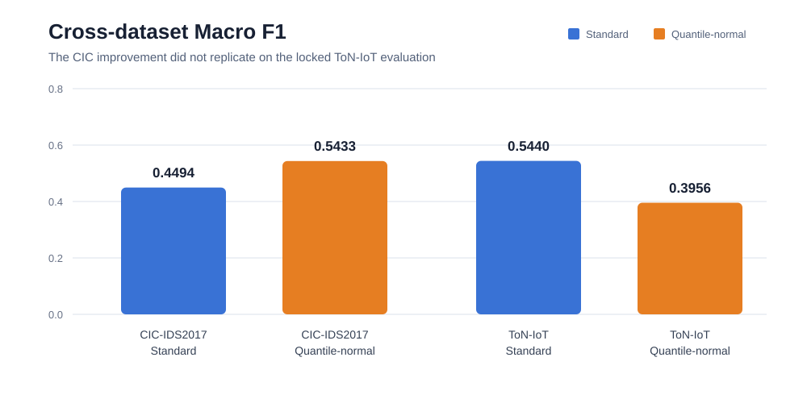
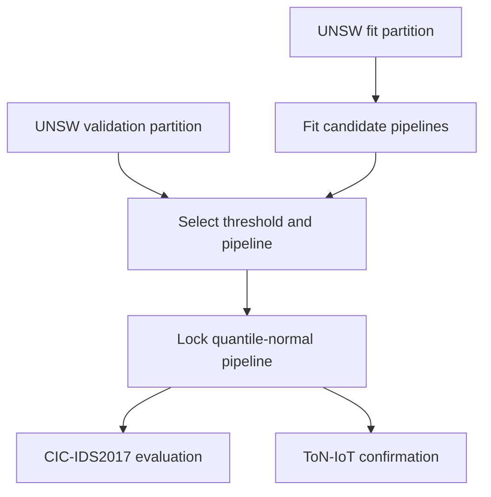

# NetGuard IDS

[](https://github.com/Minator-web/netguard-ids/actions/workflows/tests.yml)


An explainable hybrid intrusion-detection research prototype combining
auditable network rules with leakage-aware machine-learning experiments.
NetGuard processes normalized events and authorized packet captures, produces
JSON and HTML incident reports, and studies how flow-based detectors fail when
traffic moves between UNSW-NB15, CIC-IDS2017, and ToN-IoT.

## Research outcome

The main result is not an inflated within-dataset accuracy score. It is a
reproducible demonstration that a mitigation which improved one external
dataset did not generalize to a third dataset.

| Evaluation | Pipeline | Macro F1 | FPR | FNR | ROC AUC |
| --- | --- | ---: | ---: | ---: | ---: |
| UNSW validation | Standard baseline | 0.7361 | 0.0999 | 0.3298 | 0.9062 |
| CIC-IDS2017 | Standard baseline | 0.4494 | 0.5443 | 0.4038 | 0.5655 |
| CIC-IDS2017 | Quantile-normal | 0.5433 | 0.3850 | 0.4163 | 0.6012 |
| ToN-IoT | Standard baseline | 0.5440 | 0.6309 | 0.2699 | 0.5268 |
| ToN-IoT | Quantile-normal, locked | 0.3956 | 0.6481 | 0.5313 | 0.4557 |

Quantile-normal preprocessing was selected using UNSW validation only and
improved the complete 2,830,743-row CIC evaluation. The same locked pipeline
then performed worse than the baseline on all 211,043 ToN-IoT rows. This
rejects a universal robustness claim and shows why independent external
validation matters. See the
[`experiment summary`](docs/EXPERIMENT_SUMMARY.md).



## Experimental protocol



Target labels never participate in fitting, preprocessing, threshold
calibration, or source-side candidate selection. The ToN-IoT run loads the
previously saved v0.9 artifact unchanged.

## Current capabilities

- Stateful TCP port-scan detection
- SYN-flood detection within a sliding time window
- Monitoring of sensitive services such as SSH and RDP
- JSON configuration for thresholds and IP allowlists
- JSONL and optional PCAP/PCAPNG input
- Authorized live packet capture with real-time terminal alerts
- Structured JSON incident reports
- Standalone dark-mode HTML dashboard
- Reproducible flow-based machine-learning baseline
- Accuracy, macro F1, per-class metrics, and confusion matrix export
- Validation-only alert-threshold calibration with untouched test evaluation
- Cross-dataset UNSW-NB15 to CIC-IDS2017 generalization experiment
- Leakage-aware three-model cross-dataset benchmark with runtime measurements
- Label-free feature-drift diagnostics across source and target datasets
- Source-only robust-preprocessing comparison with locked target evaluation
- Third-dataset evaluation of locked pipelines on ToN-IoT Network
- Automated unit tests and GitHub Actions

## Quick start

Python 3.10 or newer is required.

```bash
python -m venv .venv
```

On Windows PowerShell:

```powershell
.venv\Scripts\Activate.ps1
python -m pip install -e .
netguard samples/demo_events.jsonl
```

On Linux or macOS:

```bash
source .venv/bin/activate
python -m pip install -e .
netguard samples/demo_events.jsonl
```

The report is written to `reports/report.json`.
The browser dashboard is written to `reports/dashboard.html`.

## Live capture

Install the packet-capture extra:

```powershell
.\.venv\Scripts\python.exe -m pip install -e ".[pcap]"
```

Then open PowerShell as Administrator and capture for 30 seconds:

```powershell
.\.venv\Scripts\python.exe -m netguard_ids.cli --live --duration 30
```

Open the resulting dashboard:

```powershell
start reports\dashboard.html
```

Windows live capture requires Npcap. Interface selection and troubleshooting
are covered in [`docs/WINDOWS_LIVE_CAPTURE.md`](docs/WINDOWS_LIVE_CAPTURE.md).

## Analyze a PCAP file

PCAP support is optional and uses Scapy:

```bash
python -m pip install -e ".[pcap]"
netguard data/capture.pcap --output reports/capture-report.json
```

Only analyze traffic that you own or are authorized to inspect. Large PCAP
files and sensitive captures are excluded from Git by default.

## Event format

Each JSONL line represents one network event:

```json
{"timestamp": 1720000000.0, "src_ip": "192.168.1.50", "dst_ip": "192.168.1.10", "src_port": 51000, "dst_port": 22, "protocol": "TCP", "flags": "S", "size_bytes": 60}
```

## Run tests

```bash
python -m unittest discover -s tests -v
```

The full environment and experiment order are documented in
[`docs/REPRODUCIBILITY.md`](docs/REPRODUCIBILITY.md).

## Machine-learning baseline

Install the optional ML dependencies:

```powershell
.\.venv\Scripts\python.exe -m pip install -e ".[ml]"
```

Generate deterministic synthetic data to verify the pipeline:

```powershell
.\.venv\Scripts\python.exe -m netguard_ids.ml_cli generate-demo
```

Train and evaluate the baseline:

```powershell
.\.venv\Scripts\python.exe -m netguard_ids.ml_cli train --dataset data\demo_flows.csv
```

Run predictions:

```powershell
.\.venv\Scripts\python.exe -m netguard_ids.ml_cli predict --model artifacts\netguard-model.joblib --input data\demo_flows.csv
```

The generated demo data is synthetic and deliberately separable. Its scores
only confirm that the software pipeline works; they must never be reported as
evidence that the model performs well on real network traffic. See
[`docs/ML_EXPERIMENTS.md`](docs/ML_EXPERIMENTS.md) for the research protocol.

## UNSW-NB15 real-data baseline

Download the official `UNSW_NB15_training-set.csv` and
`UNSW_NB15_testing-set.csv` files into `data/`. Dataset files are ignored by
Git and must not be committed to this repository.

Run the binary baseline on the complete official split:

```powershell
.\.venv\Scripts\python.exe -m netguard_ids.ml_cli train-unsw
```

For the ten-class experiment:

```powershell
.\.venv\Scripts\python.exe -m netguard_ids.ml_cli train-unsw --task multiclass --model artifacts\unsw-multiclass.joblib --metrics reports\unsw-multiclass.json --summary reports\unsw-multiclass.md
```

The command preserves the supplied training/testing split, handles missing and
categorical values inside the saved pipeline, and reports accuracy, balanced
accuracy, macro F1, weighted F1, per-class metrics, and a confusion matrix.
See [`docs/UNSW_NB15.md`](docs/UNSW_NB15.md).

### Calibrate the binary alert threshold

The default binary model produced a high false-positive rate on the official
test split. Select a threshold on a held-out part of the training split, then
compare it once on the untouched official test split:

```powershell
.\.venv\Scripts\python.exe -m netguard_ids.ml_cli calibrate-unsw
```

The default target is a validation false-positive rate of 10%. Change it with
`--target-fpr`, for example `--target-fpr 0.05`. The generated Markdown report
compares false-positive rate, false-negative rate, attack recall, and macro F1.
The test set never participates in threshold selection; a different test FPR
is therefore possible and is useful evidence of distribution shift. See
[`docs/THRESHOLD_CALIBRATION.md`](docs/THRESHOLD_CALIBRATION.md).

## Cross-dataset evaluation

Download the official CIC-IDS2017 `MachineLearningCSV.zip`, extract its CSV
files into `data/CIC-IDS2017/`, and keep the existing UNSW training CSV in
`data/`. Dataset files are ignored by Git.

Train only on UNSW-NB15, select the threshold only on an UNSW validation split,
and evaluate the unchanged pipeline on every CIC-IDS2017 CSV:

```powershell
.\.venv\Scripts\python.exe -m netguard_ids.ml_cli cross-dataset
```

The loader processes CIC data in chunks to avoid loading all 80+ source columns
into memory. Ten shared flow features are explicitly mapped and converted to
common units. CIC labels are used only for final scoring—not training,
preprocessing, feature selection, or threshold selection. For a quick software
check only, `--max-cic-rows` can limit input rows; never report a limited run as
the full experiment. See [`docs/CROSS_DATASET.md`](docs/CROSS_DATASET.md) and
the [`full-dataset results`](docs/CROSS_DATASET_RESULTS.md).

### Compare model families

Run the same leakage-aware experiment with SGD Logistic, Random Forest, and
Histogram Gradient Boosting:

```powershell
.\.venv\Scripts\python.exe -m netguard_ids.ml_cli benchmark-models
```

All three models receive identical UNSW fit/validation rows and shared
features. Each threshold is selected independently on UNSW validation data,
then all models are evaluated on the same CIC rows in one pass. The report also
includes fit time and target inference throughput. CIC results are exploratory;
a third untouched dataset is needed to confirm any model selected from this
comparison. See [`docs/MODEL_BENCHMARK.md`](docs/MODEL_BENCHMARK.md).
The complete 2,830,743-row run is documented in
[`docs/MODEL_BENCHMARK_RESULTS.md`](docs/MODEL_BENCHMARK_RESULTS.md).

### Diagnose feature drift

Measure how each shared feature changes between UNSW-NB15 and CIC-IDS2017
without using CIC labels:

```powershell
.\.venv\Scripts\python.exe -m netguard_ids.ml_cli analyze-drift
```

The command scans all CIC rows for missingness and keeps a deterministic,
uniform random-priority sample for distribution tests. It reports PSI, the KS
statistic, medians, and median shift scaled by the source IQR. PSI severity
cutoffs are diagnostic heuristics, not universal laws. See
[`docs/FEATURE_DRIFT.md`](docs/FEATURE_DRIFT.md). The complete 2,830,743-row
analysis is documented in
[`docs/FEATURE_DRIFT_RESULTS.md`](docs/FEATURE_DRIFT_RESULTS.md).

### Test source-only robust preprocessing

Compare standard scaling, robust scaling, and a quantile-to-normal mapping:

```powershell
.\.venv\Scripts\python.exe -m netguard_ids.ml_cli robust-preprocessing
```

All preprocessing is fitted on the UNSW fit partition, thresholds and the
candidate winner are selected on UNSW validation data, and that choice is
locked before CIC files are read. CIC labels are used only for the final
descriptive comparison. See
[`docs/ROBUST_PREPROCESSING.md`](docs/ROBUST_PREPROCESSING.md). In the complete
run, the source-selected quantile-normal pipeline improved target macro F1 from
0.4494 to 0.5433 and reduced target FPR from 0.5443 to 0.3850. See the
[`full-dataset results`](docs/ROBUST_PREPROCESSING_RESULTS.md).

### Validate on a third dataset

Download the ToN-IoT network train/test CSV and place it at
`data/TON_IoT_Train_Test_Network.csv`. Then evaluate the unchanged standard
baseline and the previously source-selected pipeline:

```powershell
.\.venv\Scripts\python.exe -m netguard_ids.ml_cli evaluate-ton
```

The command loads the existing v0.9 artifact; it does not fit or select a
model, transformer, feature set, or threshold using ToN-IoT. Eight inputs are
available or derived, while two IAT inputs are filled by the already-fitted
source imputers. See
[`docs/THIRD_DATASET_TON_IOT.md`](docs/THIRD_DATASET_TON_IOT.md). On the full
211,043-row evaluation, quantile-normal preprocessing did not replicate its CIC
improvement: macro F1 fell from the standard baseline's 0.5440 to 0.3956. See
the [`full third-dataset results`](docs/THIRD_DATASET_RESULTS.md).

## Research direction

The next research milestone will analyze why the locked mitigation failed and
quantify uncertainty without changing the registered model choice. The focus
remains cross-dataset performance, false positives,
explainability, and resource cost rather than accuracy alone.
See [`docs/RESEARCH_ROADMAP.md`](docs/RESEARCH_ROADMAP.md).

## Ethics and limitations

NetGuard is intended for defensive security research and authorized network
monitoring. The current rules are a baseline and may generate false positives.
Do not use the output as the sole basis for operational security decisions.

## License

MIT
